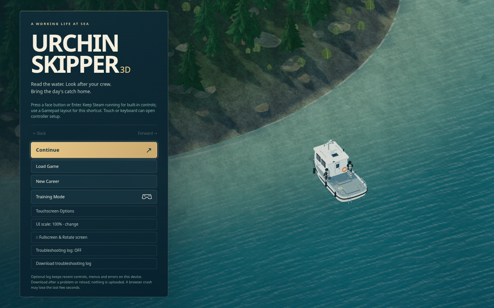

# Urchin Skipper 3D

A separate Three.js edition of Urchin Skipper: skipper a commercial dive boat, look after two autonomous divers, learn the coast, and bring the day's catch home.



The original 2D project and repository are read-only reference. This repository is independent: **https://github.com/lucidfir-ops/UrchinSkipper3D**.

## Play locally

Node.js 24+ (or 22.13+), a current browser with WebGL 2, and hardware acceleration are recommended.

```sh
npm ci
npm run build
npm start
```

Open **http://127.0.0.1:5184/**. For development use `npm run dev -- --port 5183`. For a phone/tablet on the same network use `npm start -- --lan` and the printed network address. TEMP ZIPs live outside Git under `exports/`.

Start with Frank's tutorial. Keyboard: W/S throttle, A/D rudder, Space neutral, Enter centre rudder, 1 deploy/board, 2 bag exchange, 3 nearby recall, Tab diver, O orders, M chart, +/- zoom, Escape menu. USB Xbox mappings and touch controls are retained. The boat keeps its throttle and rudder settings when controls are released.

Settings → **3D graphics** cycles High, Balanced and Battery. On a Steam Deck in a web browser, Settings → **Steam Deck controls** (automatic on a Deck) lets the built-in sticks and buttons play: left stick or D-pad steers, A centres/selects, B or ☰ opens the menu, Y neutral, L1 deploy/board, R1 bag, left trackpad zoom. Escape, P or the browser Back button opens the menu during play.

## What is preserved

The source simulation, full career, fifteen physical maps, twelve career hulls, permanent two-diver limit, crew, stock depletion, weather, tide, currents, grounding, recovery, markets, inspections, wildlife, progression and controls are carried forward. The boat-following camera remains orthographic. Presentation never writes collision geometry or simulation positions.

Three.js renders the ocean, coast, seabed, vessels, divers' surface cues, wildlife and effects. The existing Phaser dependency supplies its proven Matter engine, audio manager and headless lifecycle; it does not render the visible game. Supplied portraits, harbour art and reference fleet illustrations remain in their menus.

3D careers use a separate `urchin3d-career-v1` storage key. Exported 2D career JSON can be deliberately imported through the existing logbook; original files are never opened for writing.

## Verification and design

Run `npm run verify -- --unit-only` for lint, formatting, the full simulation suite and build. Install Chromium with `npx playwright install chromium`, then `npm run verify` also checks the live title/tutorial, keyboard/touch, vessel/weather presentation, a complete controller voyage, iframe hosting and a live GPU performance sample. It uses its own production server on port 5186. On Linux the Chromium tests explicitly enable the available GPU via Vulkan; software-only environments can be very slow. `PLAYWRIGHT_BROWSERS_PATH` is respected. Firefox can be checked separately with `npm run verify -- --browsers-only --suite=firefox`. The inherited long-form browser fixtures remain in `scripts/verify-legacy.js` for targeted historical investigation. See [PROJECT_STATUS.md](PROJECT_STATUS.md) for verified results and limitations, [PLAYTEST_GUIDE.md](PLAYTEST_GUIDE.md) for acceptance checks, and [DEVELOPMENT_NOTES.md](DEVELOPMENT_NOTES.md) for the renderer boundary. The inherited [design Bible](bible.md) remains gameplay authority with the separate 3D presentation decision recorded in its relevant sections.

All dependencies retain their licences. Existing supplied artwork is preserved. New vessel geometry, surface textures, trees and effects are authored procedurally in this project; no restrictive third-party art library was introduced.
